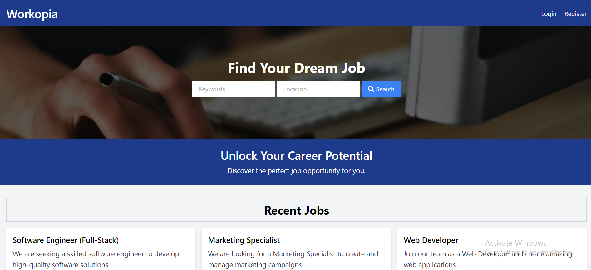

   
    
   

  

    
    
    
    
  

  <h3 align="center">Workopia (A Job Listing Application)</h3>

   

     Workopia is a job-listing application that includes a custom Laravel-like router, controller, classes, views, a database layer and a project structure using PSR-4 autoloading.
    

## 📋 <a name="table">Table of Contents</a>

1. ⚙️ [Tech Stack](#tech-stack)
2. 🔋 [Features](#features)

 

## <a name="tech-stack">⚙️ Tech Stack</a>

- PHP
- MySQL
- TailwindCSS

 

## <a name="features">🔋 Features</a>

👉 **Search Job Listings**: Users can search the latest job listings.

👉 **Register/Login**: Users can register and log in to the application.

👉 **Create Job Listing**: Users can create new job listings.

👉 **Update Job Listing**: Users can update the job listing that they have posted.

👉 **Delete Job Listing**: Users can delete the job listing that they have posted.

 